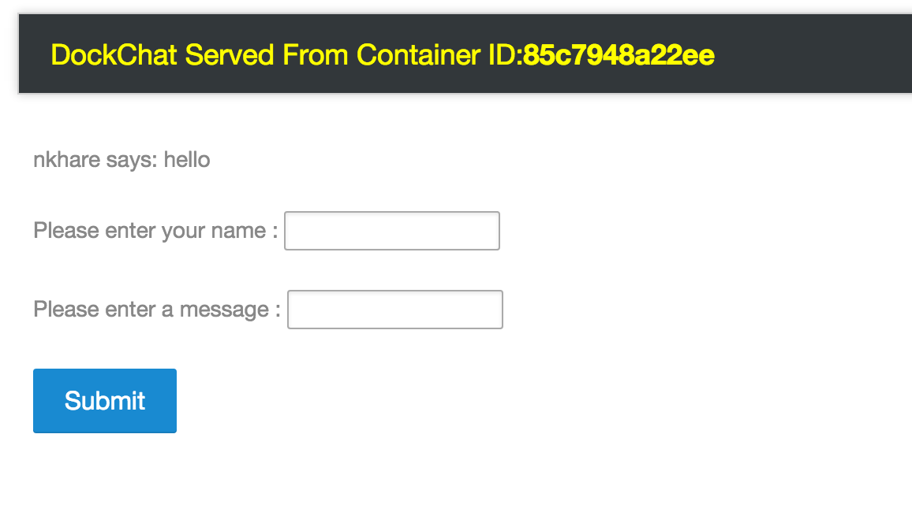
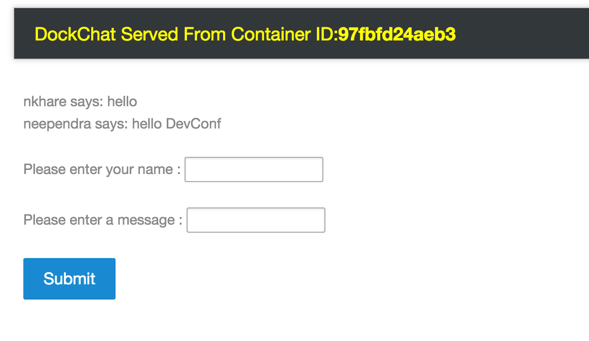
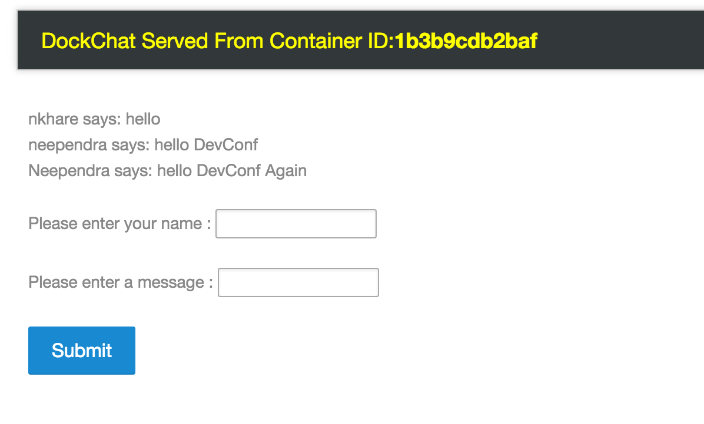

Once you start getting lots of hits on your website, you would like to scale it. You can choose to scale
- on the same node
- across multiple nodes in the cluster
   * more than one copy running on same node
   * only one copy runs on one node 

As we can not map same port from host machine multiple times. So we need a way to register all of instacnes of web application to some entity, and from that we should be able to access any instacne. That entity should behave like Load Balancer.

(Interlock)[https://github.com/ehazlett/interlock] is an event-driven plugin that can register new containers to HAProxy.


```
$ cd /Users/nkhare/work/containers-orchestration/simple/swarm/1_master_2_nodes_interlock
```

```
$ Neependras-MacBook-Pro:1_master_2_nodes_interlock nkhare$ docker-compose up -d
Creating 1master2nodesinterlock_db_1
Creating 1master2nodesinterlock_web_1
Creating 1master2nodesinterlock_interlock_1
Neependras-MacBook-Pro:1_master_2_nodes_interlock nkhare$ docker-compose ps
               Name                             Command               State                 Ports
----------------------------------------------------------------------------------------------------------------
1master2nodesinterlock_db_1          /entrypoint.sh --smallfiles      Up      27017/tcp
1master2nodesinterlock_interlock_1   /usr/local/bin/interlock - ...   Up      443/tcp, 192.168.99.104:80->80/tcp
1master2nodesinterlock_web_1         python webapp.py                 Up      192.168.99.104:32779->5000/tcp
```

- update the /etc/hosts file on your desktop/laptop

```
192.168.99.104 dockchat.com
```



- Scale

```
Neependras-MacBook-Pro:1_master_2_nodes_interlock nkhare$ docker-compose scale web=5
Creating and starting 2 ... done
Creating and starting 3 ... done
Creating and starting 4 ... done
Creating and starting 5 ... done
Neependras-MacBook-Pro:1_master_2_nodes_interlock nkhare$ docker-compose ps
               Name                             Command               State                 Ports
----------------------------------------------------------------------------------------------------------------
1master2nodesinterlock_db_1          /entrypoint.sh --smallfiles      Up      27017/tcp
1master2nodesinterlock_interlock_1   /usr/local/bin/interlock - ...   Up      443/tcp, 192.168.99.104:80->80/tcp
1master2nodesinterlock_web_1         python webapp.py                 Up      192.168.99.104:32779->5000/tcp
1master2nodesinterlock_web_2         python webapp.py                 Up      192.168.99.104:32781->5000/tcp
1master2nodesinterlock_web_3         python webapp.py                 Up      192.168.99.104:32780->5000/tcp
1master2nodesinterlock_web_4         python webapp.py                 Up      192.168.99.104:32783->5000/tcp
1master2nodesinterlock_web_5         python webapp.py                 Up      192.168.99.104:32782->5000/tcp
```





