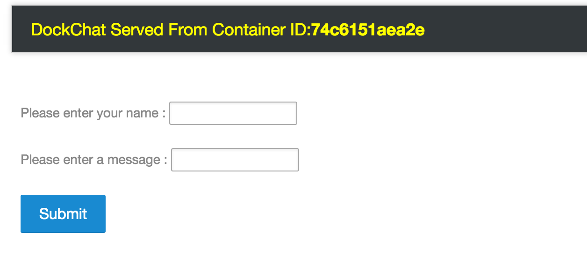

Here is the Docker compose file :- 

```
# Mongo DB
db:
  image: mongo
  expose:
    - 27017
  command: --smallfiles
# Python App
web:
  image: nkhare/dockchat:v1
  ports:
    - "5000:5000"
  links:
   - db:db
```  

which consist of two containers, *db* and *web*. *db* container would get created from *mongo* images and *web* container from *nkhare/dockchat:v1* image which got create from this [Dockerfile](https://github.com/nicolaka/dockchat/blob/master/Dockerfile). In the *web app*, we would see following settings for *mongodb*

```
#Mongo Settings
client = MongoClient('db', 27017) # db is the hostname for the mongodb daemon. Need to link the db container to this container and create a local alias in etc/hosts.
db = client.test_database
collection = db.test_collection
posts = db.posts
```

*web app* would look try to connect to *db* on port *27017*, which can be resolved by  


```
docker-machine create -d virtualbox dev

Neependras-MacBook-Pro:swarm nkhare$ docker-machine  ls
NAME   ACTIVE   URL          STATE     URL                         SWARM   DOCKER   ERRORS
dev    -        virtualbox   Running   tcp://192.168.99.115:2376           v1.9.1
Neependras-MacBook-Pro:swarm nkhare$ eval $(docker-machine env dev)
Neependras-MacBook-Pro:swarm nkhare$ docker-machine ls
NAME   ACTIVE   URL          STATE     URL                         SWARM   DOCKER   ERRORS
dev    *        virtualbox   Running   tcp://192.168.99.115:2376           v1.9.1
```


```
$ pwd
Neependras-MacBook-Pro:standalone nkhare$ pwd
/Users/nkhare/work/containers-orchestration/simple/swarm

$ cd standalone
$ Neependras-MacBook-Pro:standalone nkhare$ docker-compose up -d
Starting standalone_db_1
Starting standalone_web_1
$ Neependras-MacBook-Pro:standalone nkhare$ docker-compose ps
      Name                   Command             State           Ports
-------------------------------------------------------------------------------
standalone_db_1    /entrypoint.sh --smallfiles   Up      27017/tcp
standalone_web_1   python webapp.py              Up      0.0.0.0:5000->5000/tcp
```

```
Neependras-MacBook-Pro:standalone nkhare$ docker-machine ip dev
192.168.99.115
```

- Open the browser and access *http://192.168.99.115:5000* 




